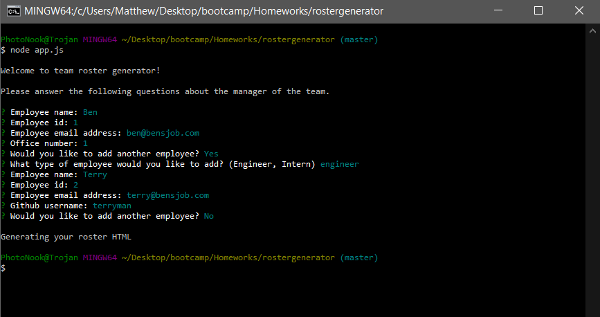
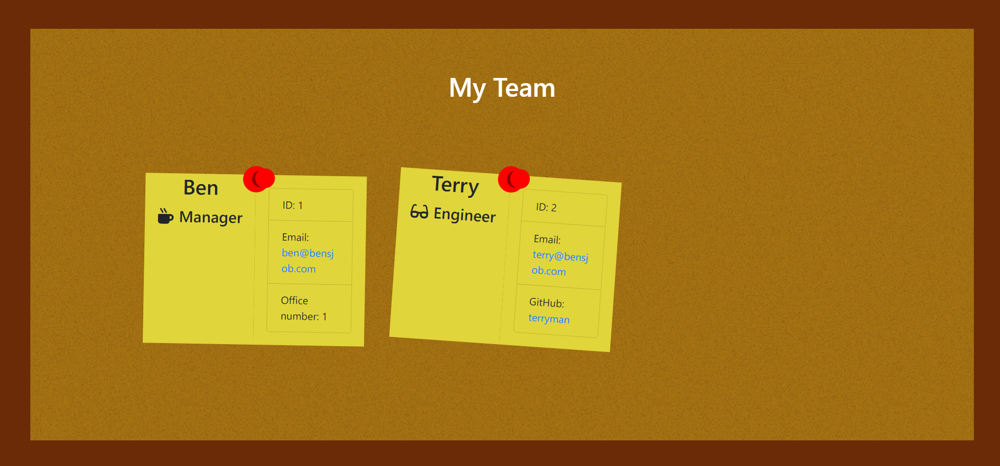

# Roster Generator
### By trojanface

## Description
A Node.js CLI app that generates a visual depiciton of a software team. This includes useful contact information for each member of the team.

## Table of Contents

1. Description
2. Contents
3. Screenshot
4. Deployed
5. Installation
6. Usage
7. License
8. Contributors
9. Tests
10. Email

## Link to Deployed App
Nil.

## Installation
1. Open node.js.
2. Install npm.
3. Use npm install to download and install necessary dependencies.

## Usage
1. From command line run node app.js
2. Answer resulting questions.
3. Find your generated HTML document in the output folder.

## License
Public Domain

## Contributors
trojanface

## Tests
npm test

Email - trojanface@hotmail.com}

